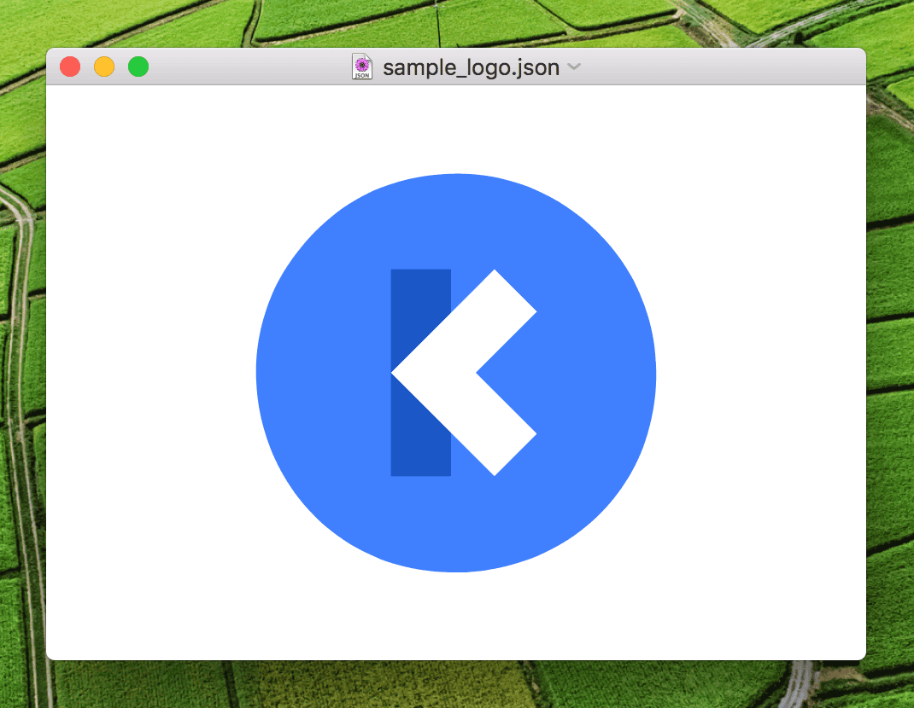

## Keyframes Player

A simple app to preview animations created with [Facebook's keyframes framework](https://github.com/facebookincubator/Keyframes) and export them to Core Animation archives.

[⬇️ DOWNLOAD LATEST RELEASE ⬇️](https://github.com/insidegui/KeyframesPlayer/releases/latest)

### Using the export option
#### Render After Effects animations in your app without external dependencies

CAAR, or Core Animation archives, are files that hold trees of `CALayer`s encoded using `NSKeyedArchiver`. Since Keyframes uses Core Animation to reconstruct animations created in After Effects, it's possible to export the animations as files that can be read in AppKit or UIKit apps later, without the need to include the Keyframes framework in the shipping app.

After exporting the .caar file, add it to your app's resources and use [this code snippet (ObjC)](https://gist.github.com/insidegui/59a7264a99d794d41236008fcf1e32d3) or [this one (Swift)](https://gist.github.com/insidegui/f63dad60fd9a99cc23f976d0a1283286) to read the animation in your app. To check if the export worked, you can use [CAAR Player](https://github.com/insidegui/CAARPlayer) on macOS to open the archive file. Not all features will work with this method, but I've found this to work with the most common shape and transform animations.

